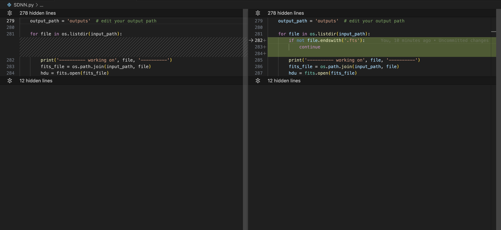

# CHANGELOG (18 Feb 2024)

## System configuration

* Hardware - Apple M2 Pro Chip
* OS - MacOS 14.3
* Python version - v3.11.7
* Pip - v23.3.1

## Package Versions

1. tensorflow==2.15.0
2. keras==2.15.0
3. astropy==6.0.0
4. matplotlib==3.8.2
5. tensorflow-metal - Optional and only for Apple silicon

## Code Change

1. SDNN.py
    
